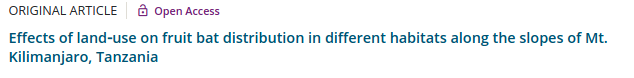

background-image: url(https://leverageedu.com/blog/wp-content/uploads/2020/08/research-project.jpg)
background-size: cover

```{r setup, include=FALSE}
options(htmltools.dir.version = FALSE)
xaringanExtra::use_scribble()
library(xaringanthemer)
xaringanExtra::use_panelset()
```

---
# Por onde começar?
.pull-left[
]

.pull-right[

## Entenda a estrutura de um projeto de pesquisa


]

---
.left-column[
## Mapa mental
- Deve ser autoexplicativo
- Qualquer pessoa deve entender
- Inspiração
]
.right-column[
.center[
]
]

---
.left-column[
## Desenho experimental
- Deve ser autoexplicativo
- Qualquer pessoa deve entender
- Contém detalhes do seu experimento
]
.right-column[
.center[
]
]

---
.left-column[
## Predições
- Devem ser gráficas
- Qualquer pessoa deve entender
- Sugerem o tipo de análise a ser usada
]
.right-column[
.panelset[
.panel[.panel-name[Ex-1]
```{r echo=FALSE, message=FALSE, warning=FALSE}
library(tidyverse)
data("iris")
iris %>% 
  ggplot(aes(Sepal.Length, Sepal.Width))+
  geom_point()
```
]
.panel[.panel-name[Ex-2]
```{r echo=FALSE, message=FALSE, warning=FALSE}
iris %>% 
  ggplot(aes(Sepal.Length, Sepal.Width, color=Species))+
  geom_point()
```
]
.panel[.panel-name[Ex-3]
```{r echo=FALSE, message=FALSE, warning=FALSE}
iris %>% 
  ggplot(aes(Species, Sepal.Width, fill=Species))+
  geom_boxplot()
```
]
.panel[.panel-name[Ex-4]
```{r echo=FALSE, message=FALSE, warning=FALSE}
iris %>% 
  ggplot(aes(Petal.Width, fill=Species))+
  geom_density()
```
]
.panel[.panel-name[Ex-5]
```{r echo=FALSE, message=FALSE, warning=FALSE}
pca<-prcomp(iris[,-5])
library(factoextra)
fviz_pca_biplot(pca, label="var", habillage=iris$Species,
               addEllipses=TRUE, ellipse.level=0.95)
```
]
]
]

---
class: center, middle
## Faça SUAS predições
## 1, 2, 3 e já!!!

```{r echo=FALSE}
library(countdown)

countdown(minutes = 5, seconds = 13)

```

---
.left-column[
## Pergunta científica
- Não pode ser respondida por "sim" ou "não"
- Abre uma nova linha de pesquisa
- Aprofunda um tema de pesqusia
- Preenche uma lacuna de conhecimento
]
.right-column[

]

---
.left-column[
## Hipótese científica
- Precisa responder à pergunta
- É afirmativa
- Não pode ser condicional
- Pode ser subdividida
]
.right-column[
.center[


*Uma hipótese (do grego antigo ὑπόθεσις, transl. hypóthesis, composto de hypo, 'sob', 'abaixo de', e thésis, 'posição') suposição ou especulação é uma formulação provisória, com intenções de ser posteriormente demonstrada ou verificada, constituindo uma suposição admissível.*

Fonte: [**Wikipedia**](https://pt.wikipedia.org/wiki/Hip%C3%B3tese)
]
]

---
.left-column[
## Título
### Conciso e direto
### Palavras-chave
### Ambicioso
### Honesto
]
.right-column[
.center[

]
]

---
.left-column[
## Títulos ruins
- Títulos longos
- Indexados geograficamente
- Generalistas
- Especialistas
- etc...

[Veja alagumas dicas aqui: PeerJ](https://peerj.com/blog/post/115284880816/the-10-most-common-mistakes-when-choosing-a-title-for-your-paper/)
]
.right-column[





]
---
.left-column[
## Títulos bons
- Títulos objetivos
- Palavras de relevância
- Sugerem o resutlado principal
- Deixam com vontade de ler o artigo
]
.right-column[


]

---
.left-column[
## Cuidado gráfico

### [Tutorial 1](https://www.cedricscherer.com/2019/08/05/a-ggplot2-tutorial-for-beautiful-plotting-in-r/)
### [Tutorial 2](http://r-statistics.co/Top50-Ggplot2-Visualizations-MasterList-R-Code.html)
]
.right-column[

]

---
.left-column[
## Objetivos

### Focado no avanço
### Não é executra um método
### Não é coletar 
### Fazer o conhecimento avançar
]
.right-column[

]

---
.left-column[
## Justificativa

### Não pode ser geográfica
### Não pode ser metodológica
### Não pode ser espécie-specífica
### Então, como?
]
.right-column[

]

---
.left-column[
## Justificativa

### O que avança?
### Para onde avança?
### Quem se beneficia?
### Como se beneficia?
]
.right-column[
.center[


[The illustrated guide to a Ph.D.](https://matt.might.net/articles/phd-school-in-pictures/)
]]

---
.left-column[
## Escrevendo propostas de financiamento

### [FUNBIO](https://www.funbio.org.br/bolsasfunbio/)
### [Rufford](https://www.rufford.org/)
### [Idea Wild](https://ideawild.org/)
### [Boticário](http://www.fundacaogrupoboticario.org.br/pt/Paginas/Inicial.aspx)
]
.right-column[
.center[
]]


---
class: center, middle
# FIM


