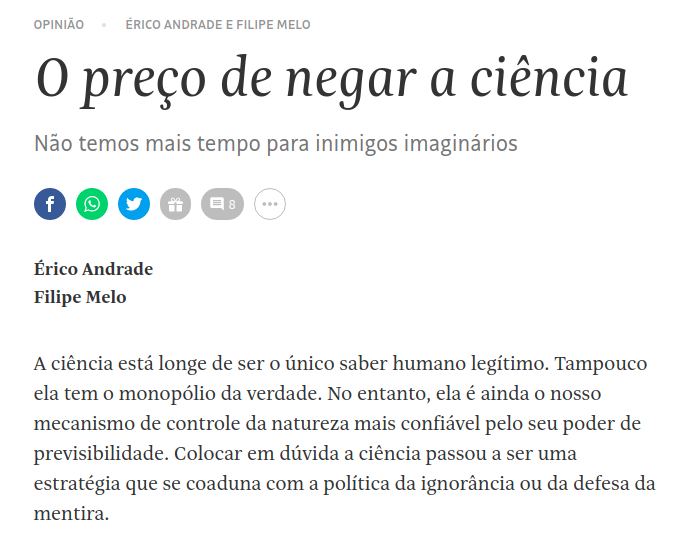
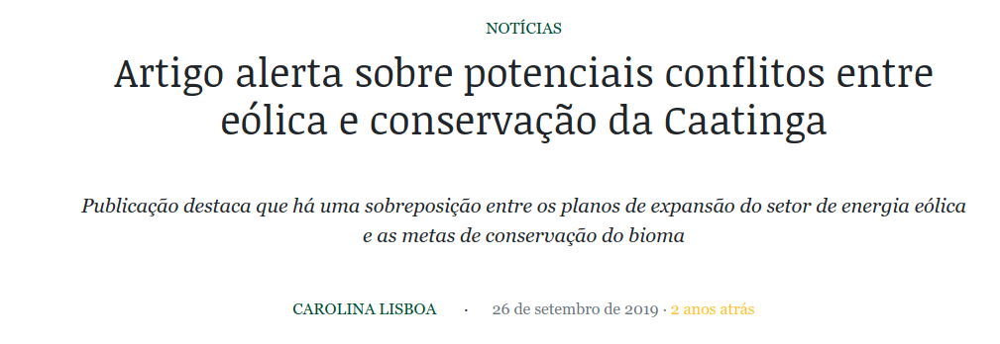

background-image: url(https://www.redebrasilatual.com.br/wp-content/uploads/2020/03/Atila.jpg)
background-size: cover

```{r setup, include=FALSE}
options(htmltools.dir.version = FALSE)
xaringanExtra::use_scribble()
library(xaringanthemer)
xaringanExtra::use_panelset()
```

---
.left-column[
## Porque escrever é uma habilidade essencial?
- Conversamos com a sociedade
]

.right-column[
.center[
]
[Artigo de opinião na Folha de São Paulo](https://folha.com/26sxhdqy)

]

---
.left-column[
## Porque escrever é uma habilidade essencial?
- Divulgamos nosso trabalho para influenciar políticas públicas
]

.right-column[
.center[
]
[Artigo alerta sobre potenciais conflitos entre eólica e conservação da Caatinga](https://www.oeco.org.br/noticias/artigo-alerta-sobre-potenciais-conflitos-entre-eolica-e-conservacao-da-caatinga/)
]


---
.left-column[
## Porque escrever é uma habilidade essencial?
- A gente pode realmente influenciar políticas públicas
]

.right-column[
.center[
<<iframe width="860" height="515" src="https://www.youtube.com/embed/tfo4iLb5PrA" title="YouTube video player" frameborder="0" allow="accelerometer; autoplay; clipboard-write; encrypted-media; gyroscope; picture-in-picture" allowfullscreen></iframe>]

]

---
# Video Abstracts
<iframe width="980" height="520" src="https://www.youtube.com/embed/NUgmctx6OlM" title="YouTube video player" frameborder="0" allow="accelerometer; autoplay; clipboard-write; encrypted-media; gyroscope; picture-in-picture" allowfullscreen></iframe>

---
class: center, middle
## Há muita vida fora da academia


---
.left-column[
## ONGs
- São um grande campo de atuação
- Podem pagar muito bem
- Trabalho com resultados
- # Cepan

]
.right-column[
<iframe width="1280" height="733" src="https://www.youtube.com/embed/y2WoR4YxYG4" title="YouTube video player" frameborder="0" allow="accelerometer; autoplay; clipboard-write; encrypted-media; gyroscope; picture-in-picture" allowfullscreen></iframe>]

---

.left-column[
## ONGs
- São um grande campo de atuação
- Podem pagar muito bem
- Trabalho com resultados
- # IIS
]
.right-column[
<iframe width="980" height="520" src="https://www.youtube.com/embed/pGsYQx8FCi4" title="YouTube video player" frameborder="0" allow="accelerometer; autoplay; clipboard-write; encrypted-media; gyroscope; picture-in-picture" allowfullscreen></iframe>]

---
.left-column[
## Muito cuidado com o Plágio
- É um problema disseminado
- Pode lhe custar um emprego ou mesmo a reputação
]

.right-column[
 [Novo ministro da Educação é acusado de plágio ](https://www.dw.com/pt-br/novo-ministro-da-educa%C3%A7%C3%A3o-%C3%A9-acusado-de-pl%C3%A1gio-em-disserta%C3%A7%C3%A3o-de-mestrado/a-53968204)
.center[
 [Plágio Retor da UFSC](https://www.brasildefato.com.br/2021/03/25/reitor-da-ufc-escolhido-por-bolsonaro-apos-ficar-em-ultimo-em-eleicao-comete-plagio)]
.right[ [texto: 4 tons de plágio](https://revistapesquisa.fapesp.br/quatro-tons-de-plagio-academico/)

]
]

---
class: center, middle
# FIM


