```{r xaringan-tile-view, echo=FALSE}
xaringanExtra::use_tile_view()
xaringanExtra::use_scribble()
xaringanExtra::use_fit_screen()
```
.right[
# As pessoas da Caatinga]

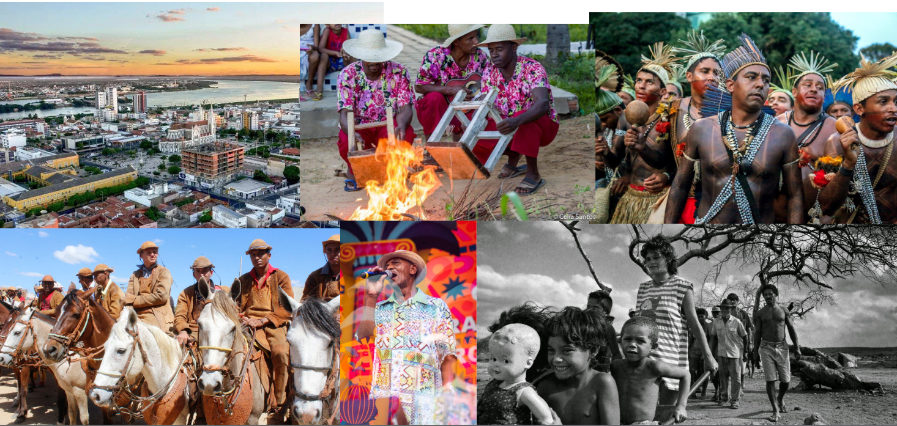

---
.right[
# Restauração para as pessoas]

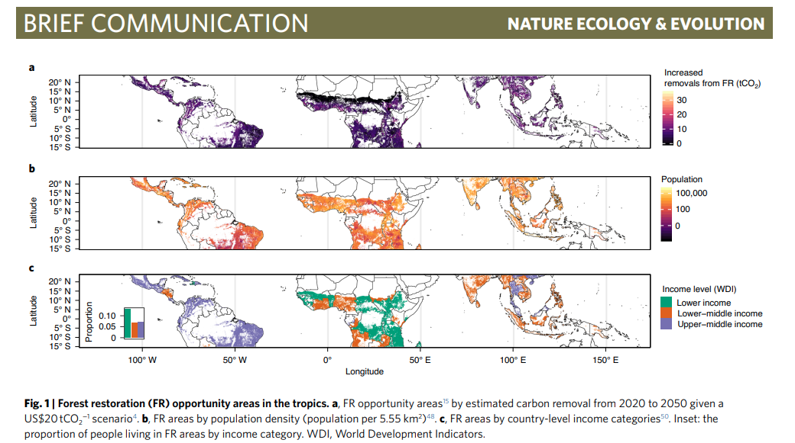


---
.right[
# Reconhecer os diversos benefícios das florestas]

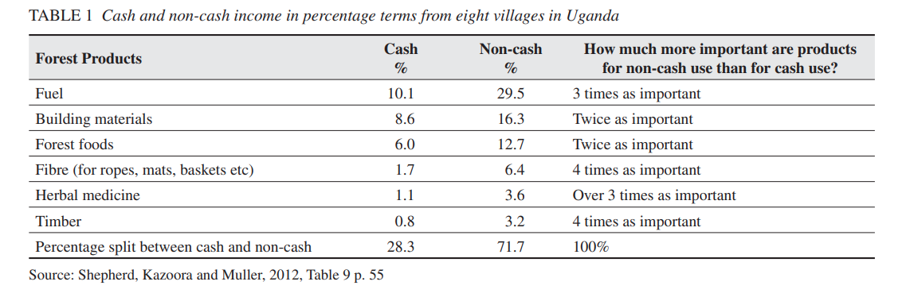

---
.right[
# Onde estão os vulneráveis do Brasil]

.pull-left[
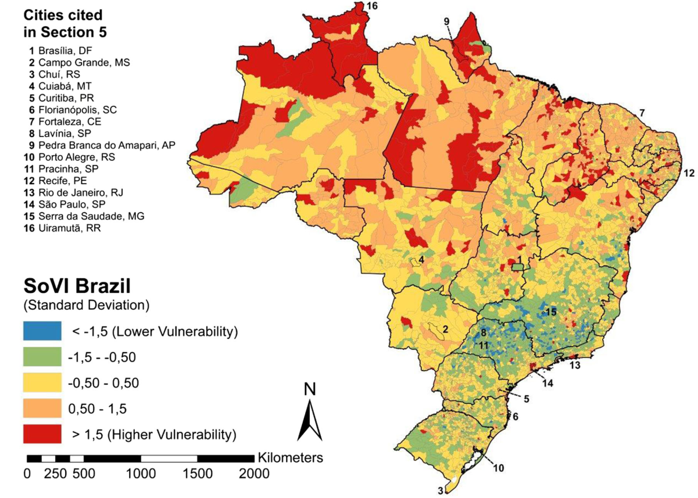
[Hummel 2016](Social Vulnerability to Natural Hazards in Brazil)

]

.pull-right[
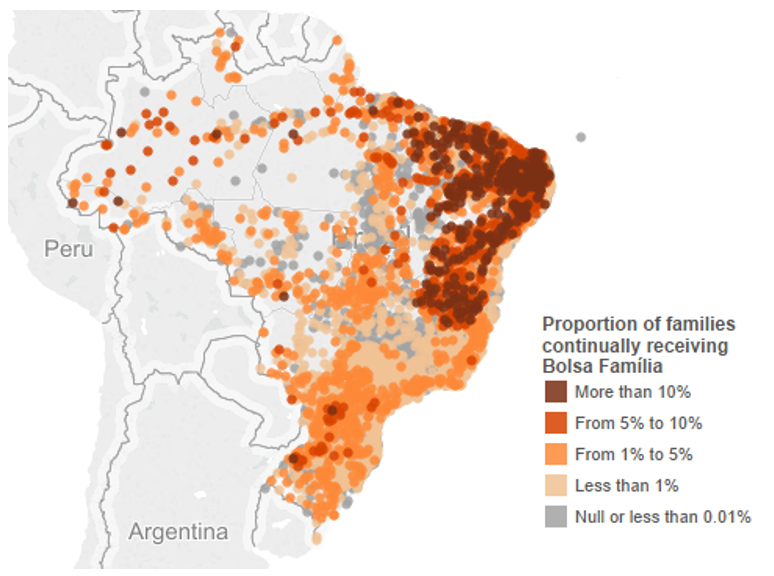
]

---
.right[
# Qual o papel da Restauração?]

--
##- Reconhecer quem se beneficia mais

--
##- Corrigir desigualdades de acesso à recursos

--
##- Contemplar modelos que atendam às demandas locais

---
.right[
# Um possível  modelo: a Caatinga]
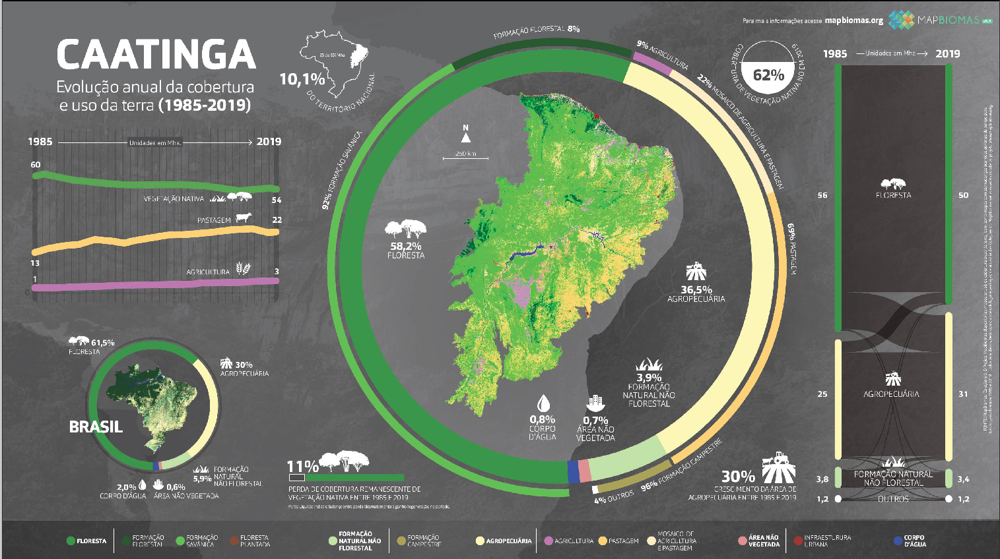

---
.right[
# Um possível  modelo: a Caatinga]

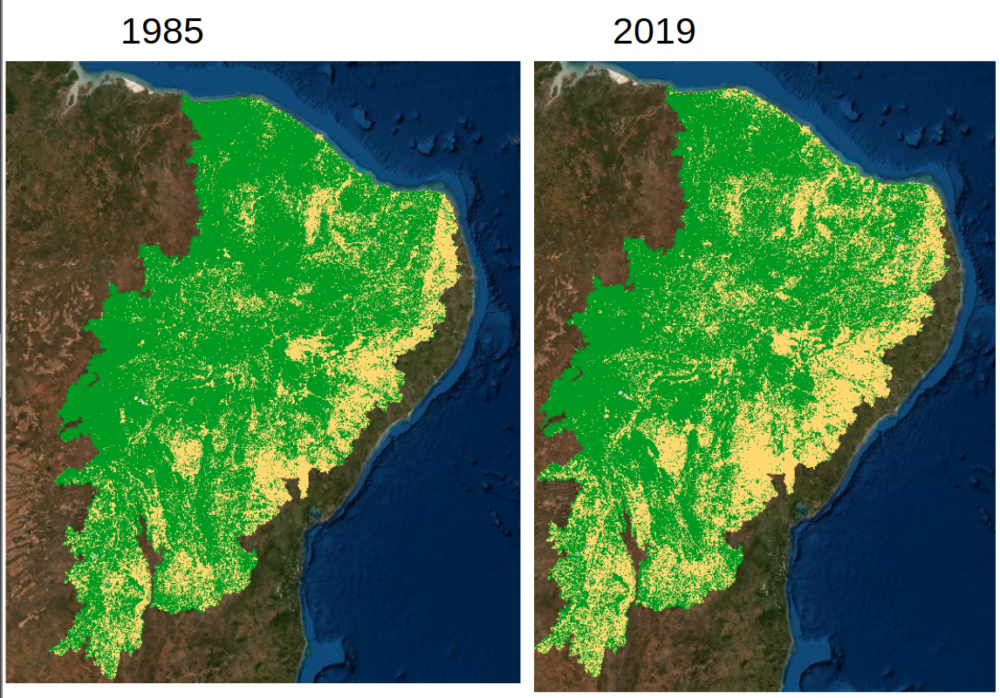

---
.right[
# Um possível  modelo: a Caatinga]


---
.right[
# Um possível  modelo: a Caatinga]
.pull-left[
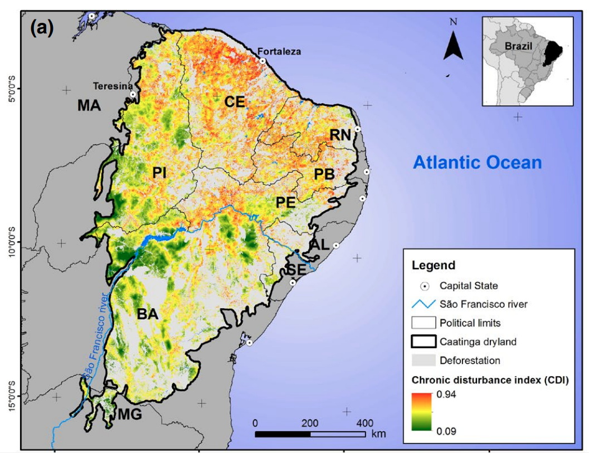
]

.pull-right[
### - Disturbio crônico
### - Associado à presença humana
### - Provocado por atividades típicas da região
]

### fonte: [Antongiovanni et al (2020)](https://besjournals.onlinelibrary.wiley.com/doi/full/10.1111/1365-2664.13686)

---
.right[
# Segruança alimentar]
.pull-left[
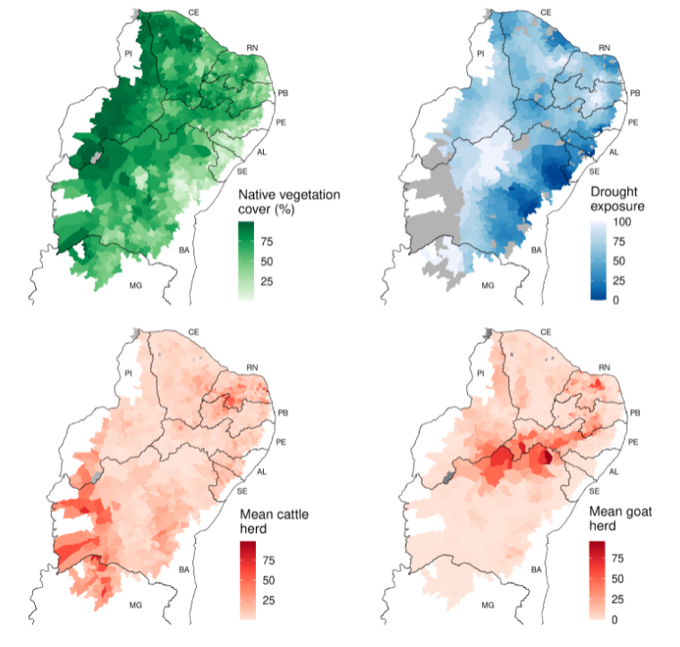
]

.pull-right[
### - Caatinga combina com bode
### - Restauração + Bode?
]

---
.right[
# Bodes e restauração]
.pull-left[

]

.pull-right[
### - Áreas de uso de 100ha
### - Hábito generalista
### - Reduzem biomassa de herbáceas
### - Preferência por hábitats abertos
### fontes: [Jamelli et al 2021](https://www.sciencedirect.com/science/article/abs/pii/S0140196321000987) e [Menezes et al 2020](https://onlinelibrary.wiley.com/doi/epdf/10.1002/ldr.3693)
]

---
.right[
# Bodes e restauração]
.pull-left[
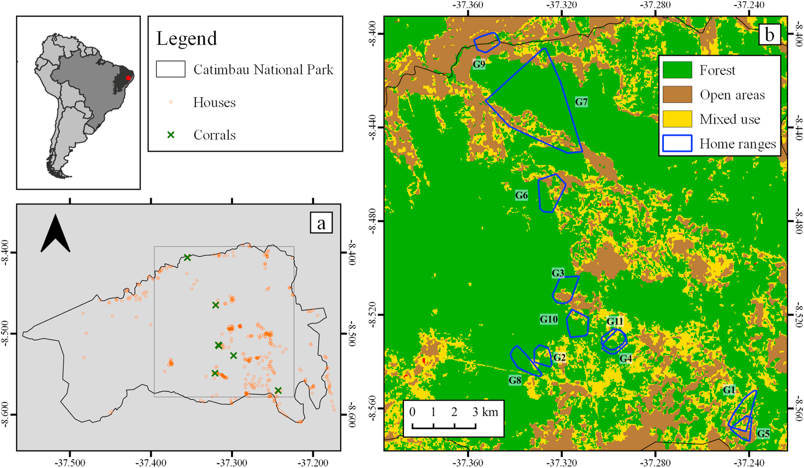
]

.pull-right[
### - Áreas de uso de 100ha
### - Hábito generalista
### - Reduzem biomassa de herbáceas
### - Preferência por hábitats abertos
### fontes: [Jamelli et al 2021](https://www.sciencedirect.com/science/article/abs/pii/S0140196321000987) e [Menezes et al 2020](https://onlinelibrary.wiley.com/doi/epdf/10.1002/ldr.3693)
]

---
.right[
# Bodes e restauração]
.pull-left[
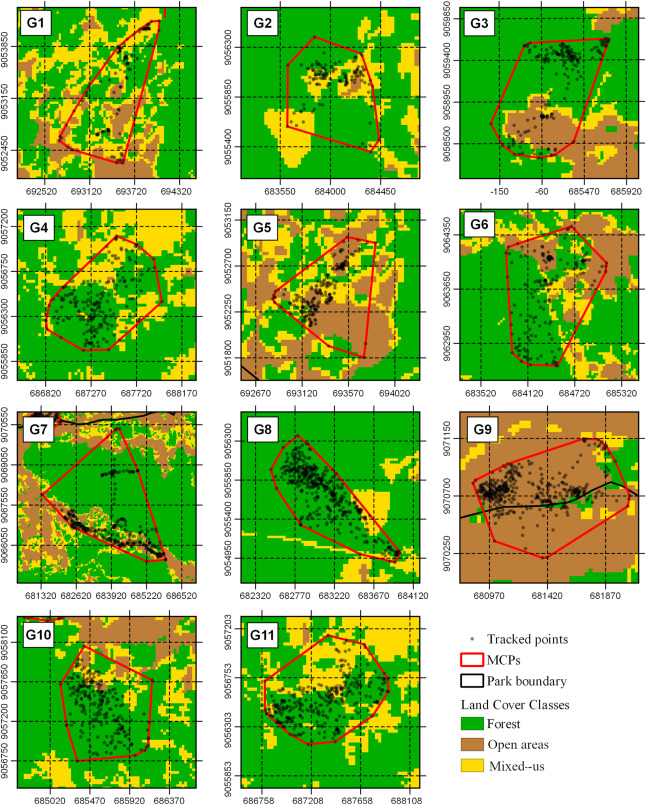
]

.pull-right[
### - Áreas de uso de 100ha
### - Hábito generalista
### - Reduzem biomassa de herbáceas
### - Preferência por hábitats abertos
### fontes: [Jamelli et al 2021](https://www.sciencedirect.com/science/article/abs/pii/S0140196321000987) e [Menezes et al 2020](https://onlinelibrary.wiley.com/doi/epdf/10.1002/ldr.3693)
]

---
.right[
# Restauração biocultural]
.pull-left[
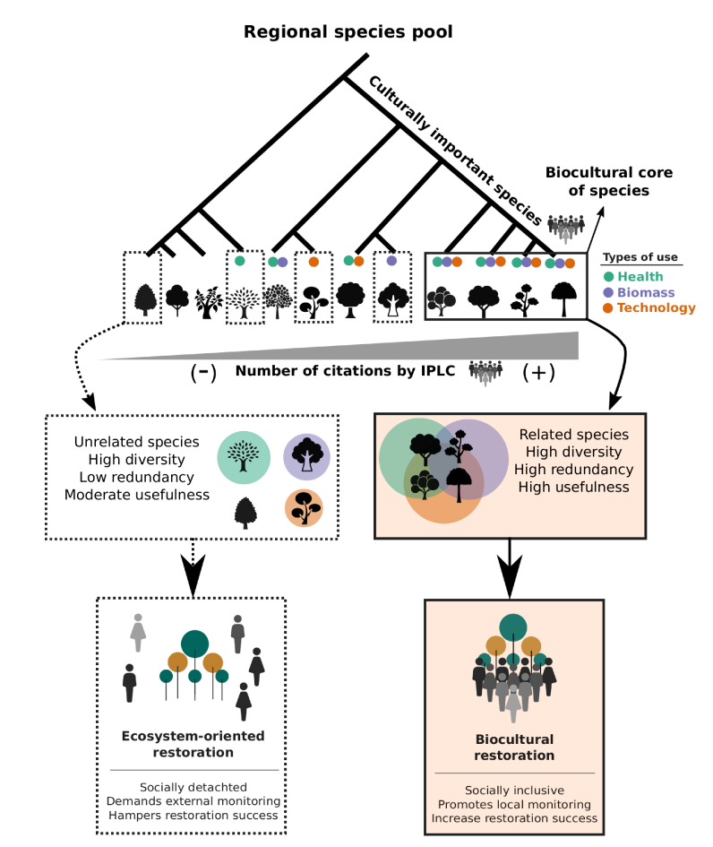
]

.pull-right[
### - Conhecimento tradicional é chave para a restauração
### - Aumenta a compromisso das pessoas
### - Reproduz características originais do sistema
### fonte: Sena et al 2021 (submetido)

]

---
.right[
# As pessoas usam espécies exóticas na Caatinga
]


.pull-left[


## *Prosopis juliflora*
]

.pull-right[

## *Nicotiana galuca*
foto: Juliano Fabricante
]

---
.right[
# A Caatinga é energia
]

.pull-left[


## 85% da energia eólica do Brasil

[Neri et al 2019](https://www.sciencedirect.com/science/article/pii/S2530064419300537)
]

.pull-right[

## Mercado de R$ 2Bi/ano
fonte: [Canal Rural](https://www.canalrural.com.br/noticias/mercado-lenha-nordeste/)
]

---
.right[
# Novos desafios para a restauração
]


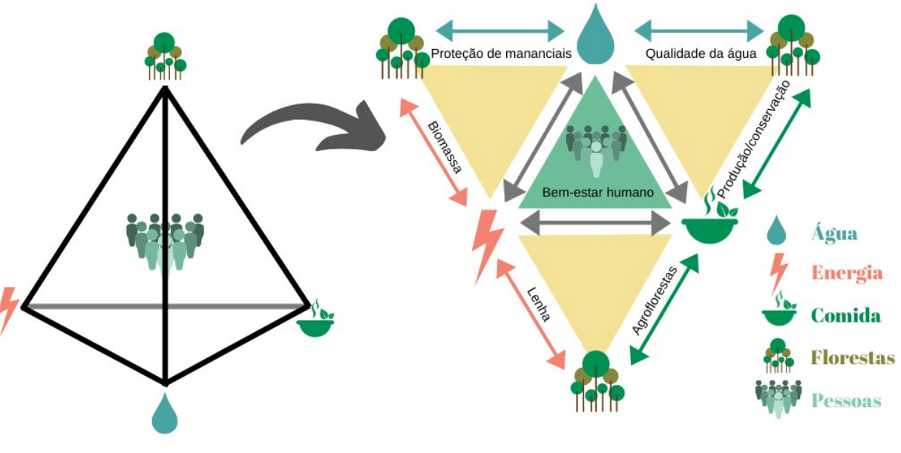

fonte: [Melo et al 2021](https://www.nature.com/articles/s41893-020-00608-z)

---
.right[
# Principais tarefas
]

## - A Caatinga será um laboratório de restauração inclusiva
## - Monitorar indicadores socioeconômicos e ambientais é crucial
## - Mover o foco do carbono e/ou biodiversidade para serviços e pessoas
## - Restauração participativa

---
class: center, middle

# Obrigado
## contato: felipe.plmelo@ufpe.br
