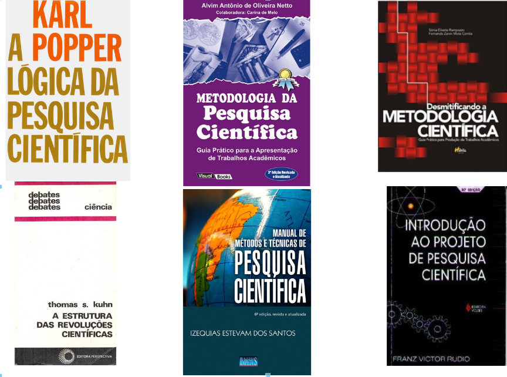
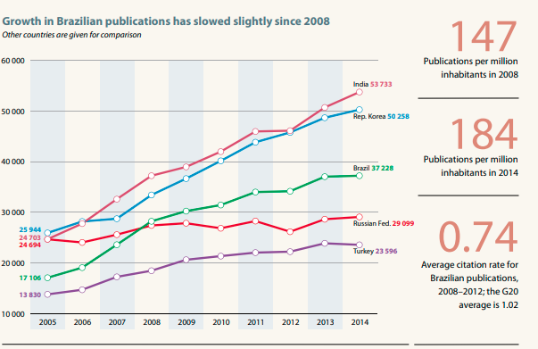
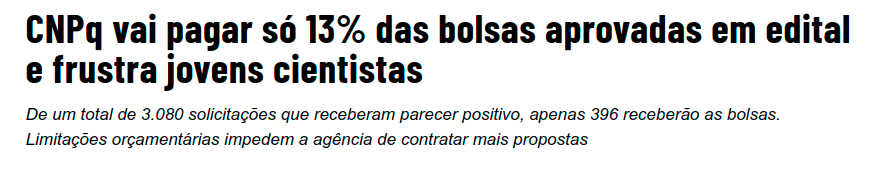
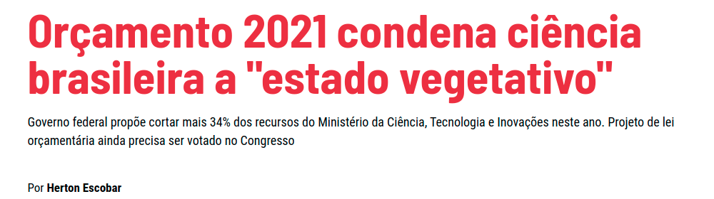

# Aprender ciência
.center[

]
---
# Inspiração _versus_ transpiração
.pull-left[

]
.pull-right[
### “Poesia é conhecimento. Inspiração, encanto, não acredito em nada dessas coisas. Poesia é esforço, é consciência, é cultura. O sujeito não pode ser inteiramente inculto e sair escrevendo poesia, por mais inspirado que ele seja... Escrever para mim é uma coisa dificílima, porque eu não queria fazer esta poesia que todo mundo faz.”
]

---
# Ciência se aprende?
## Tutorial, tem! Consulte o [Wikihow](https://www.wikihow.com/Become-a-Scientist)
.center[

]
---
# Exemplos de cientistas

.pull-left[

###"Escolha um tema e um grupo que lhe apaixone"
]
.pull-right[
]
"...decidiu escrever cartas para quem ele foi: um garoto apaixonado pela natureza, mas inseguro em relação ao futuro, a procura de sua identidade e de seu lugar em um mundo nem sempre fácil, mas invariavelmente fascinante."

---
# Erros comuns de quem tenta a sorte na ciência
.pull-left[
###- Lê pouco, muito pouco
###- Não conhece nem minimamente a história da ciência
###- Especializa-se muito cedo
###- Não cultiva a curiosidade
###- Aceita a inércia acadêmica
###- Transforma pós-graduação em "emprego"
]

--

.pull-right[

]

---
# Caminhos para ser feliz e produtivo na ciência
.pull-left[

]
.pull-right[
###- Tenha um <mark>*forte hábito*</mark> de leitura
###- Conheça a história da sua área de conhecimento
###- Construa referenciais de análise
###- Pratique o reciocínio científico
###- Identifique as habilidades que precisa desenolver
]

---
#Por que fazer uma pósgraduação?

.pull-left[

### ( ) Tô lisa, sem um pau pra dar num gato
### ( ) Todos meus amig@s estão fazendo
### ( ) Não sei o que fazer com o diploma de biólogo
### ( ) Adoro meu orientador do PIBIC
### ( ) Quero ser cientista
### ( ) Todas as anteriores
]
.pull-right[

]

---
# As dúvidas persistem?
.center[

]
---
# Fato 1- Você é um priviliegiado
.center[
]

---
# Fato 1- Você é um priviliegiado
.center[
]

fonte: [ANPG](http://www.anpg.org.br/16/07/2020/mapeamento-nacional-de-bolsas-da-capes/)

---
# Fato 2- Você tem responsabilidade social
.pull-left[
###- Quem paga sua bolsa?
###- Por que o Brasil forma cientistas?
###- Qual a prioridade da educação brasileira?
###- Você tem ideia do orçamento de C&T?
###- Quem financia a ciência no Brasil?
]

.pull-right[

]

---
# Fato 3- O país tem responsabilidade social com quem forma
.center[
´

]

---
# A ciência é uma política em permanente construção
.pull-left[
###- Estamos aumentando muito a formação de mestres e doutores
###- Não há como absorver a todos em IFES
###- Há pouco espaço na iniciativa privada, mas há
###- Há muita competição
]
.pull-right[
]

---
# Quais habilidades podem ser úteis para uma PG?
.pull-left[
###- Saber fazer perguntas e hipóteses
###- Planejar ações de curto, médio e longo prazo
###- Identificação das habilidades a serem desenvolvidas
###- Criar rede de colaboração
###- <mark> Arrumar dinheiro
]
.pull-right[

]
---
class: center, middle
#FIM

